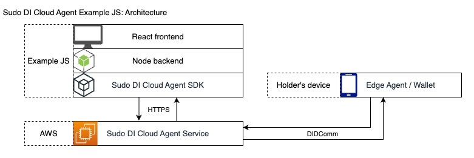

# Sudo DI Cloud Agent Example JS

## Purpose

The purpose of this example app is to demonstrate how to use the **Sudo DI Cloud Agent SDK** as found on [GitHub](https://github.com/sudoplatform-labs/sudo-di-cloud-agent-js) or [npm](https://www.npmjs.com/package/@sudoplatform-labs/sudo-di-cloud-agent).

## Architecture

The example app is composed of a Node backend and React frontend. The backend consumes the **Sudo DI Cloud Agent SDK** ("the SDK") to interact with the admin API of an instance of **Sudo DI Cloud Agent Service** ("the Cloud Agent Service") deployed in AWS. The frontend exists purely to provide a GUI to the functionality implemented in the backend.



#### File structure

- `frontend/` contains the React frontend
- `backend/` contains the Node backend
- `backend/src/server.ts` is the main Node server script
- `backend/src/CloudAgent.ts` is where the SDK is used directly

## Prerequisites

Please note the following before running this example app and using the SDK:
- You must have an instance of the Cloud Agent Service deployed in AWS. The Cloud Agent Service should have already posted a public Endorser DID to the ledger.
- You must have access to the secret API key required to authenticate the SDK with the Cloud Agent Service's admin endpoint.

## Startup

In `backend`, copy `.env.template` to `.env`:

```bash
cp backend/.env.template backend/.env
```

Adjust `.env` to your environment.
CAUTION: This `.env` file contains secrets used to authenticate to the admin endpoint of the Cloud Agent Service. These secrets should be kept secure. Never expose these secrets to a frontend application. A production application should never store these secrets in unencrypted plaintext.

#### IMPORTANT NOTICE

It is up to you, as the user of this example app, to ensure the example app is only executed against a TEST environment.
To make this point clear:
- this example app should NOT be executed against a production Cloud Agent Service, and
- this example app should NOT be executed against a Cloud Agent Service which is pointing to a production ledger.

Install dependencies:

```bash
yarn install-deps
```

Build:

```bash
yarn build
```

Start server:

```bash
yarn start
```

## How to use this example app

Once the example app is up and running, you will require a wallet app (also known as an Edge Agent) on your mobile device. This is required throughout the example in order to create a connection with the Cloud Agent Service, issue a credential and verify the credential.

If you would like to reset the example app to start a fresh connection, you may do so at any time by refreshing the page in your web browser.
